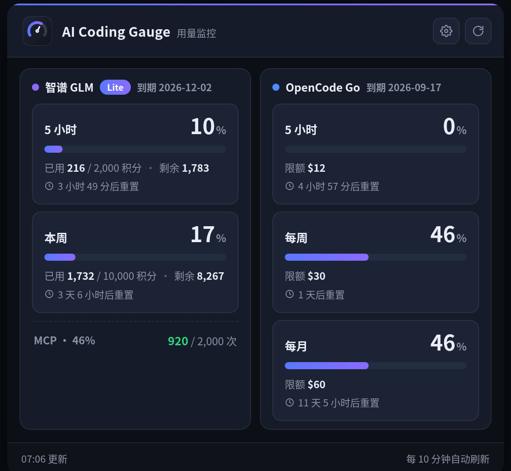
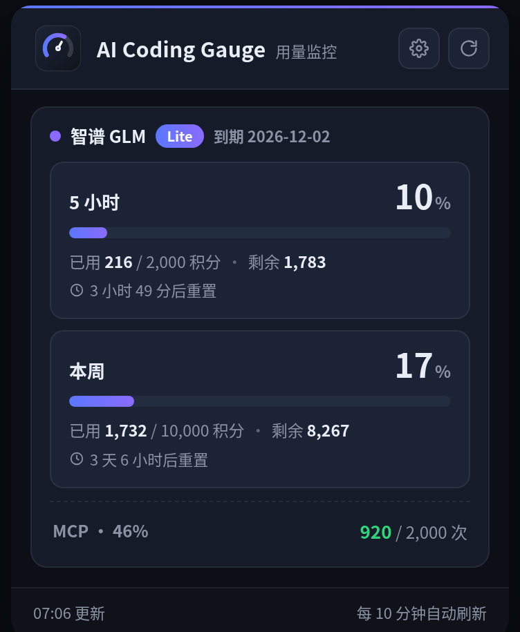
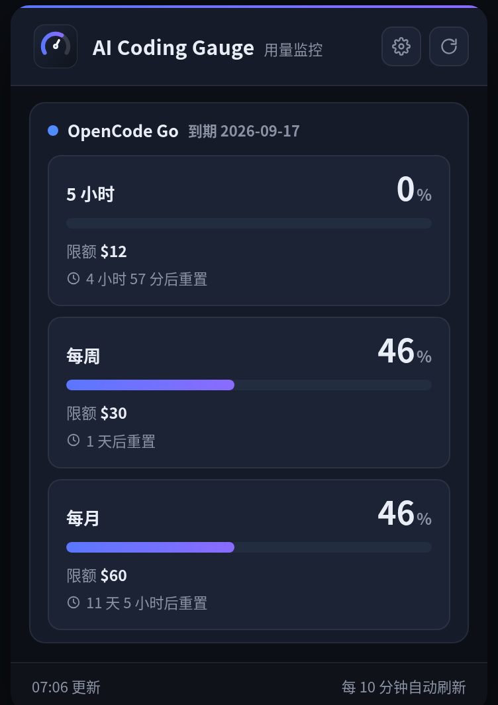
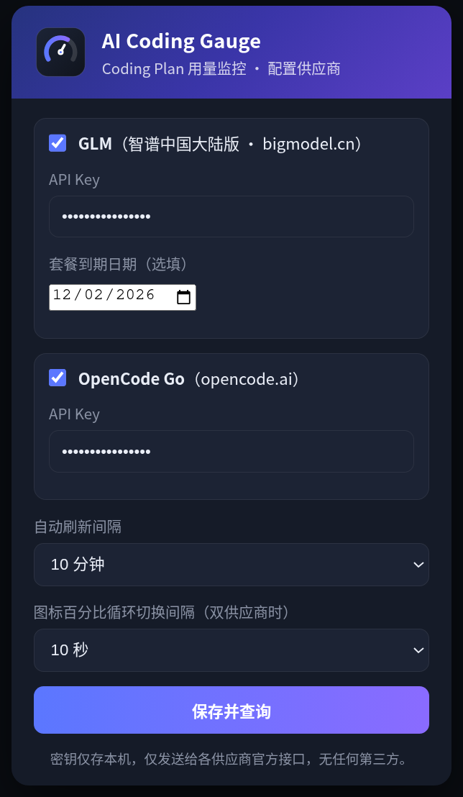

<div align="center">


# AI Coding Gauge

**多供应商 AI Coding Plan 用量监控面板（Chrome 扩展）**

实时查看智谱 **GLM（中国大陆版）** 与 **OpenCode Go** 的 Coding Plan 用量：5 小时 / 每周 / 每月（MCP）额度，工具栏徽章随时掌握当前 5 小时使用占比。

-96%2B-blue)   

[简介](#简介) · [截图](#截图) · [安装](#安装) · [配置](#配置) · [隐私与安全](#隐私与安全) · [开发](#开发)

</div>

---

## 简介

本扩展支持**多供应商**，可同时监控多个 AI Coding Plan 订阅的用量消耗情况：

### 智谱 GLM（中国大陆版 `open.bigmodel.cn`）

- 套餐等级（Lite / Pro / Max）与**到期日期**，临近到期变黄、已过期变红
- **5 小时额度**与**每周额度**的已用百分比、已用/总额、剩余、重置时间
- **月末 MCP** 调用次数（账号存在该额度时显示）

### OpenCode Go（`opencode.ai`）

- **rolling 5 小时 / 每周 / 每月** 三条窗口用量与重置时间（官方 `/zen/go/v1/usage` 接口）
- **当月套餐到期日**自动推算：由每月额度的自动重置时间计算，临近到期变色提醒

### 通用

- 两个供应商可**复选启用**，同时启用时面板**分栏**显示；工具栏图标（单行大字号）**循环切换**显示两家 5 小时用量百分比
- 图标循环间隔可在**设置中自定义**（5–60 秒）
- 只启用一个供应商时，面板与徽章仅显示该家（徽章保持原尺寸、单个大百分比）
- 各供应商**独立拉取、故障隔离**：一方失败不影响另一方
- 图标徽章颜色按当前显示的那家百分比阈值：绿 <80% / 黄 80–95% / 红 >95%
- 订阅等级与到期日期显示在**所属面板标题行**，信息随面板、不串位

数据来自各供应商**官方公开接口**，密钥仅存本机，仅发给官方接口，无任何第三方服务或埋点。

## 功能特性

- [x] 多供应商（智谱 GLM / OpenCode Go）复选 + 各自 API Key
- [x] 分栏显示双供应商用量；单个供应商时仅显示该家
- [x] 循环切换徽章（双供应商时图标循环显示两家 5h 百分比，间隔可设置）
- [x] 5 小时 / 每周 / 每月额度横向进度条（已用%、已用/总额、剩余、重置倒计时）
- [x] 套餐等级 + 到期日期显示（到期 ≤7 天变黄、已过期变红）
- [x] OpenCode Go 当月到期日自动推算（基于每月额度重置时间）
- [x] 工具栏徽章（占比实时显示，阈值变色；双供应商可配置循环切换间隔）
- [x] 自动刷新（1–30 分钟可设）
- [x] 深色扁平 UI、全中文

## 截图

> 以下为内置模拟数据渲染的界面截图，不包含任何真实账号数据。

<p align="center">
  <br/>
  <sub>双供应商同时启用：分栏显示，订阅等级与到期日期随面板标题行展示</sub>
</p>

| 仅智谱 GLM | 仅 OpenCode Go | 设置页 |
|:---:|:---:|:---:|
|  |  |  |

## 安装

### 方式一：本地加载（开发者/自用）

1. 下载或克隆本仓库到本地目录。
2. 打开 `chrome://extensions`（Edge：`edge://extensions`）。
3. 打开右上角「开发者模式」。
4. 点击「加载已解压的扩展程序」，选择项目根目录（含 `manifest.json` 的目录）。
5. 浏览器工具栏出现扩展图标。

> 也可以在 [Releases](https://github.com/zetsubouk/ai-code-gauge/releases) 下载 `ai-code-gauge.zip`，解压后按上述步骤加载。

### 方式二：Chrome Web Store（正式发布后）

> 上架链接待补充。上架后可在商店一键安装并自动更新。

详细步骤见 [docs/INSTALL.md](docs/INSTALL.md)。

## 配置

点扩展图标 → ⚙ 设置：

1. **GLM API Key**：到 [bigmodel.cn](https://open.bigmodel.cn/) 后台「API Keys」复制（与你在 Claude Code / ZCode 等工具中配置的密钥一致）。
2. **OpenCode Go API Key**（可选）：勾选 OpenCode Go 并填入 opencode.ai 的 API Key。
3. **套餐到期日期**（选填，GLM）：填写你的订阅到期日，将显示在套餐等级后，临近到期会有颜色提醒。
4. **自动刷新间隔**：1–30 分钟。
5. **图标循环切换间隔**（双供应商时）：5–60 秒。
6. 保存后面板自动查询并展示。

密钥只存本机 `chrome.storage.local`，仅发送给对应供应商官方监控接口。

## 隐私与安全

- **密钥不离开本机**：仅用于向官方监控接口鉴权，不上传任何第三方。
- **无广告 / 无统计 / 无追踪**。
- 内置 `docs/API.md` 完整记录了所有请求端点与数据结构，供审计。

## 技术栈与结构

- **Manifest V3** + 原生 HTML/CSS/JS，零构建依赖
- 后台 `service-worker`：`chrome.alarms` 定时刷新、徽章更新、数据缓存
- 弹窗 `popup/`：横向进度条仪表 + 用量明细
- 共享模块 `shared/`：接口封装 / 平台常量 / 格式化

```
ai-code-gauge/
├── manifest.json              # MV3 配置
├── background/service-worker.js # 定时刷新、徽章、缓存
├── popup/                     # 弹窗 UI（html/css/js）
├── shared/                    # api.js / constants.js / go.js / format.js
├── icons/                     # 扩展图标（16/32/48/128）
├── docs/                      # API.md 接口契约 / INSTALL.md 安装指南 / screenshots 截图
├── scripts/                   # 图标生成 / 打包 / 接口冒烟测试
├── design/                    # 品牌与 UI 设计稿（html 演示页）
└── package.json               # 开发脚本
```

## 开发

```bash
npm run test:api   # 接口冒烟测试（需 BIGMODEL_KEY 环境变量）
npm run icons      # 重新生成图标
npm run build      # 打包发布 zip 到 dist/
```

接口契约与实测数据结构见 [docs/API.md](docs/API.md)。

## 版本历史

见 [CHANGELOG.md](CHANGELOG.md)。

## 贡献

欢迎提交 Issue 与 PR，流程见 [CONTRIBUTING.md](CONTRIBUTING.md)。

## 许可证

[MIT](LICENSE)

---

*本项目与智谱、OpenCode 等供应商官方无任何关联，为社区独立开发，仅作个人用量监控用途。*
